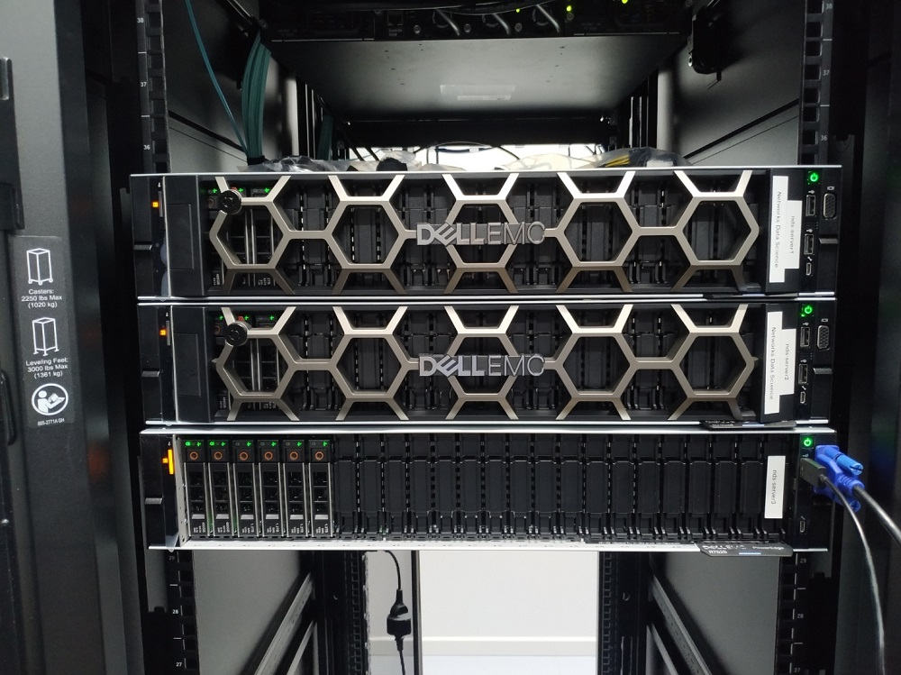
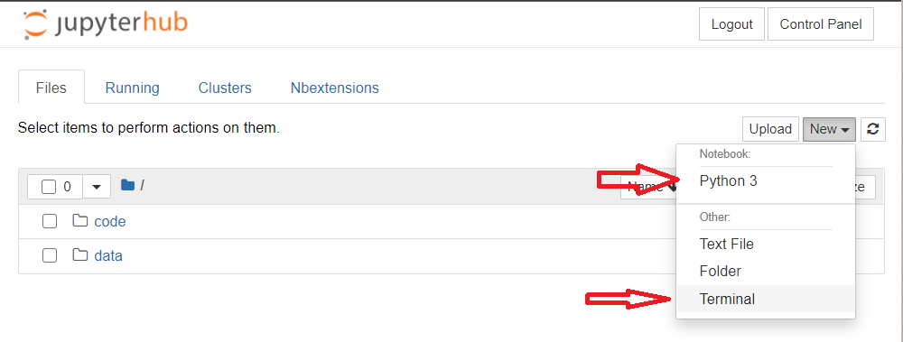
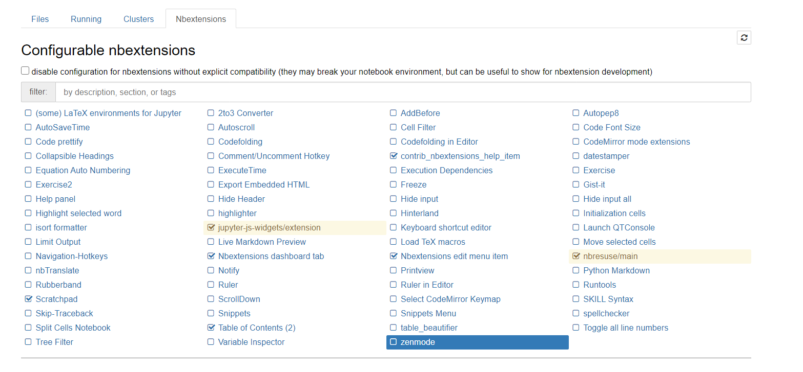
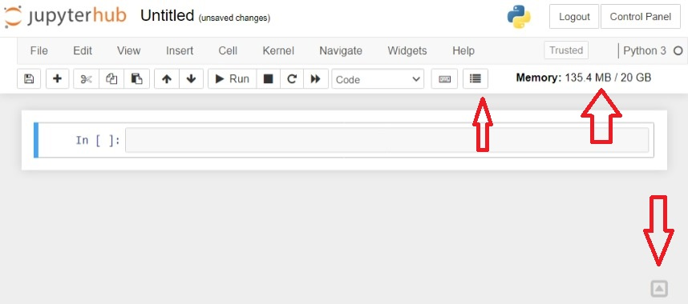

# NDS Servers
- [NDS Servers](#nds-servers)
  - [NDS Servers](#nds-servers-1)
  - [Access](#access)
  - [Download](#download)
  - [Python kernels](#python-kernels)
  - [Resources limit](#resources-limit)
  - [TMUX](#tmux)
  - [Nbextensions](#nbextensions)
  - [Directory structure](#directory-structure)
  - [Software](#software)


## NDS Servers


The Networks Data Science (NDS) group have 3 DELL Servers.
They operate inside a VLAN only for the NDS group which is `172.16.26.0/24`, and the specifications are:
| Server name |           OS            |  RAM   |  CPU  |        Hard Drive        |      GPU      |     IPs     |
| :---------: | :---------------------: | :----: | :---: | :----------------------: | :-----------: | :---------: |
| santiago.networks.imdea.org | Ubuntu Server 20.04 LTS | 126GB  |  96   | 1 x 480GB (OS) 1 x 3.6TB |      NO       | 172.16.26.2 |
| munez.networks.imdea.org | Ubuntu Server 20.04 LTS | 126GB  |  96   | 1 x 480GB (OS) 1 x 3.6TB |      NO       | 172.16.26.3 |
| skynet.networks.imdea.org | Ubuntu Server 20.04 LTS | 62.6GB |  64   | 1 x 480GB (OS) 1 x 4.2TB | 2 x A100 40GB | 172.16.26.4 |


## Access
The default way of access the server is trough `ssh`.
However, all the server exposed a JupyterHub platform where it possible to open jupyter notebooks and a terminal.



Each user can change their own password
* For JupyterHub platform `https://<server>/hub/auth/change-password`
* For `ssh` access `sudo passwd <username>` 

## Download

It's possible to download and upload files using `scp` command

```bash 
# Download
scp -r <username>@<server_name>:<remote_file> <local_dest>

# Upload
scp -r <local_file> <username>@<server_name>:<remote_dest>
```

## Python kernels

For avoid software conflict, is **request** that each user have their own python virtual environments.
By default, a python environment was created for each user, and is accessible through Jupyter Notebook.
For create another virtual environment, it recommended to run this commands in the terminal:

```bash
conda init bash
source .bashrc
conda deactivate
conda create --name <vitual_env_name>
conda activate <vitual_env_name>
conda install -y <some_package> # eg: numpy
conda install -cy anaconda ipykernel
python -m ipykernel install --user --name=<vitual_env_name>
```
where `<vitual_env_name>` is the name of your virtual environment.
This environment is installed in the user home folder's and appear in the new notebook kernels lists.

By default the terminal and JupyterHub load automatically the default virtual environment.
It possible to overwrite this behavior modifying the end of the `/home/<jupyter-user_name>/.bashrc` file.

```bash
conda deactivate
conda activate <venv_name>
```

## Resources limit 

The amount of CPU and RAM memory for the Jupyter Notebooks are limited:
|   Server    |           Resources            |
| :---------: | :----------------------------: |
| santiago | up to 30GB RAM & up to 30 CPUs |
| munez | up to 30GB RAM & up to 30 CPUs |
| skynet | up to 20GB RAM & up to 20 CPUs |

For the specific case of Skynet server, to limit the use of the GPU the only method know so far is to set a value on the machine learning python library. Eg: for `tensorflow`
```python 
import tensorflow as tf
init = tf.global_variables_initializer()

gpu_options = tf.GPUOptions(per_process_gpu_memory_fraction=<percentage>)
with tf.Session(config=tf.ConfigProto(gpu_options=gpu_options)) as sess:
    sess.run(init)
    ############
    #Training happens here#
    ############
``` 
if you know other way for limit the usage for each user please let's know.
The previous solution was extracted from https://stackoverflow.com/questions/54912579/is-it-possible-to-threshold-the-maximum-gpu-usage-per-user
where <percentage> is a float between `(0, 1)` that the represent the GPU percentage that the library have access.


## TMUX
The Jupyter Notebooks will disconnects after 5 hours with out user interactions and **for running long projects this is not the recommended way**. 
Instead the users are encouraged to use the  `tmux` command (https://www.hamvocke.com/blog/a-quick-and-easy-guide-to-tmux/).
With `tmux`, users can create virtual terminals that keeps alive when the `ssh` connection is over and allow to attach or detached when they need it.
Some useful commands are:
```bash
# create a new tmux terminal
tmux

# run some command
python my_long_script.py

# press ctrl+b, and then press the "d" key for detached

# for list tmux terminal and ids
tmux ls 

# for attach to a terminal
tmux attach -t <id>
```


## Nbextensions
Jupyter Notebook offers extensions for simplify the workflow.
This is the list of available plugins:


The recommend "getting started" extensions are:
* Table of content: that show a outline of the content based in markdown headlines. 
* Scratchapd: a float cell that allow you write small test code without adding more cells in the notebook
* Nbresuse: that show the consume of RAM memory (enabled by default)

For more information: https://medium.com/@maxtingle/10-jupyter-notebook-extensions-making-my-lyfe-easier-f40139a334ce



## Directory structure

For *backup important files like code or Notebook, etc*, each user have in their home folder a folder called **code**.
This folder is a backup for the case of hardware failure, but it is not a repository of changes.
For *save large files* there is also, a folder called **data**.
Is **mandatory** that each user save the larger files inside **data** and **not in** the root of the home folder due to limited space.

## Software

There is a Spark cluster accessible through `spark://munez.networks.imdea.org:7077`,
and a Hadoop cluster at `hdfs://munez.networks,imdea.org:9000` respectively.
For connect to the Spark cluster using python it need the `pyspark` python package.
```bash
hdfs dfs -ls /
```
