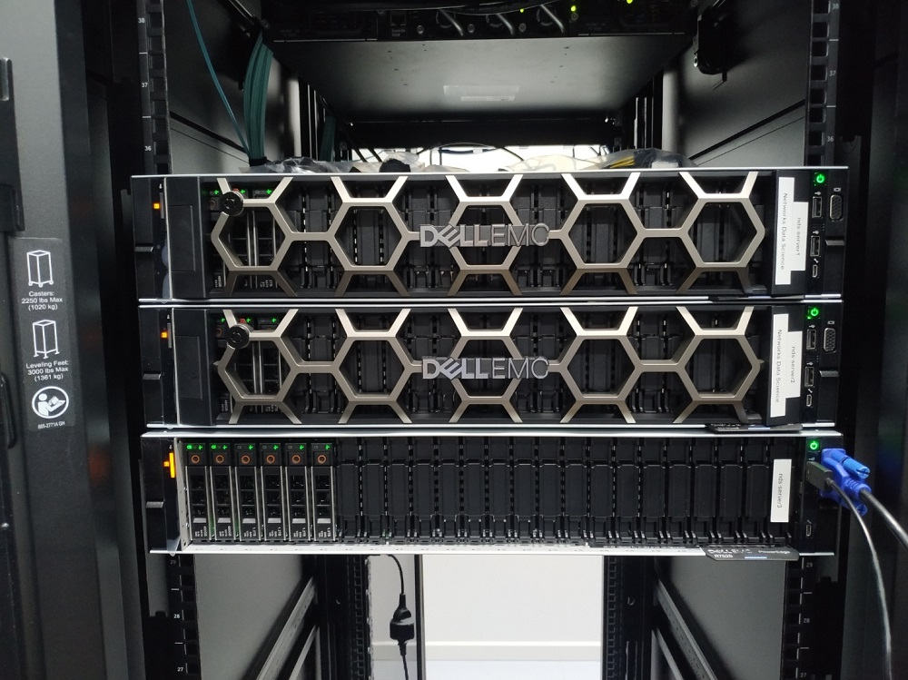
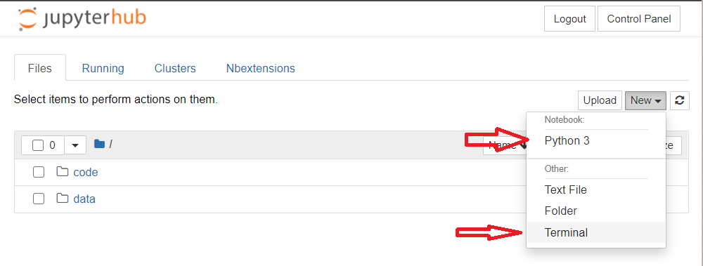
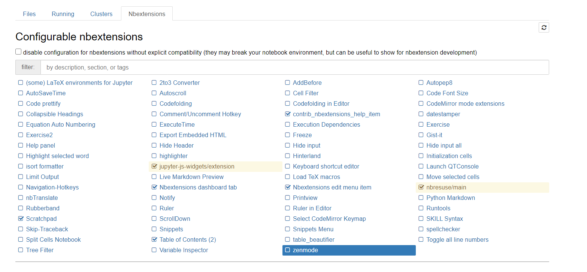
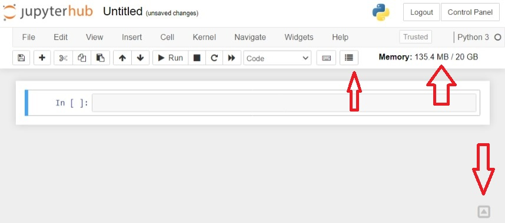

# NDS Servers
- [NDS Servers](#nds-servers)
  - [NDS Servers](#nds-servers-1)
  - [Requests an user account](#requests-an-user-account)
  - [JupyterHub](#jupyterhub)
  - [download](#download)
    - [Python kernels](#python-kernels)
    - [Resources limit](#resources-limit)
    - [TMUX](#tmux)
    - [Nbextensions](#nbextensions)
  - [File system](#file-system)
    - [Directory structure](#directory-structure)
    - [Culling idle notebook servers](#culling-idle-notebook-servers)
  - [Software](#software)


## NDS Servers


The Networks Data Science (NDS) group have 3 DELL Servers.
They operate inside a VLAN only for the NDS group which is `172.16.26.0/24`, and the specifications are:
| Server name |           OS            |  RAM   |  CPU  |        Hard Drive        |      GPU      |     IPs     |
| :---------: | :---------------------: | :----: | :---: | :----------------------: | :-----------: | :---------: |
| nds-server1 | Ubuntu Server 20.04 LTS | 126GB  |  96   | 1 x 480GB (OS) 1 x 3.6TB |      NO       | 172.16.26.2 |
| nds-server2 | Ubuntu Server 20.04 LTS | 126GB  |  96   | 1 x 480GB (OS) 1 x 3.6TB |      NO       | 172.16.26.3 |
| nds-server3 | Ubuntu Server 20.04 LTS | 62.6GB |  64   | 1 x 480GB (OS) 1 x 4.2TB | 2 x A100 40GB | 172.16.26.4 |

## Requests an user account

To access the servers need it to request an user account from the system administrator: **Dr. Marco Fiore**.

## JupyterHub

The standard way of access the server is through JupyterHub web platform.
With yours user account you can login on:
* https://nds-server2.networks.imdea.org
* https://nds-server3.networks.imdea.org


It possible to change the password visiting `https://<server>/hub/auth/change-password`

With JupyterHub you can use **jupyter notebooks** and also a **ssh** terminal.


## download
sudo passw user

scp -r jupyter-leonardo@172.16.26.3:/home/jupyter-leonardo/data/srsLTE /home/somefolder

### Python kernels

For avoid software conflict, is request that each user have their own python virtual environments.
Also, those environments can be accessible through Jupyter Notebook.
For create a virtual environment open the terminal and run:
```bash
conda init bash
source .bashrc
conda deactivate
conda create --name <venv_name>
conda activate <venv_name>
conda install -y <some_package> # eg: numpy
conda install -cy anaconda ipykernel
python -m ipykernel install --user --name=<venv_name>
```
where `<venv_name>` is the name of your virtual environment, eg: leonardoNetworksSimulation

This `venv` is installed in the user home folder's.
After that, those environments appear in the new Notebook kernels lists.

By default JupyterHub load automatically the default `base` environment in the terminal, for overwrite this behavior the following lines should be add at the end of `.bashrc` user file.

```bash
# /home/<jupyter-user_name>/.bashrc

conda deactivate
conda activate <venv_name>
```

### Resources limit 

The amount of CPU and RAM memory are limited.
Depending of the servers those limit varies.

|   Server    |           Resources            |
| :---------: | :----------------------------: |
| nds-server2 | up to 30GB RAM & up to 30 CPUs |
| nds-server2 | up to 30GB RAM & up to 30 CPUs |
| nds-server3 | up to 20GB RAM & up to 20 CPUs |

**IMPORTANT**: For restrict the use of the GPU the only method know so far is to set a value on the Machine Learning python library/module.
Eg: for `tensorflow`
```python 
import tensorflow as tf
init = tf.global_variables_initializer()

gpu_options = tf.GPUOptions(per_process_gpu_memory_fraction=<percentage>)
with tf.Session(config=tf.ConfigProto(gpu_options=gpu_options)) as sess:
    sess.run(init)
    ############
    #Training happens here#
    ############
``` 
solution extracted from https://stackoverflow.com/questions/54912579/is-it-possible-to-threshold-the-maximum-gpu-usage-per-user
where <percentage> is a float between `(0, 1)` that the represent the GPU percentage that the library have access.
**It's mandatory** that all user set this value in function of their tasks and the team also.


### TMUX
**Use jupyter notebook or the web terminal for running long projects is not recommended**. 
Instead the users are encouraged to use the  `tmux` command for that.
With `tmux`, users can create virtual terminal that keeps alive when the `ssh` connection is over and allow to attach or detached when they need it.

```bash
# create a new tmux terminal
tmux

# run some command
python my_long_script.py

# press ctrl+b, raise your fingers and then press the "d" key for detached

# for list tmux terminal and ids
tmux ls 

# for attach to a terminal
tmux attach -t <id>
```

### Nbextensions
Jupyter Notebook offers extensions for simplify our workflow.
This is the list:


The recommend "getting started" extensions are:
* Table of content 
* Scratchapd (a float cell that allow you write small test code without adding more cells in the notebook)
* Nbresuse (show use of RAM memory)



## File system

All the servers have two kinds of hard drive disks, SSD, and SATA (RPM). 
It was decided to use the SSD for installing the OS and software and keep the SATA for storage.

### Directory structure

For *backup important files like codes / Notebooks, etc*, each user have in their home folder of a folder called **code**.
This folder is a backup for the case of hardware failure, but it is not a repository of changes.
For *save large files* there is also a inside home, a folder called **data**.
Is **mandatory** that each user save the larger files inside **data** and **not in** the root of the home folder.


### Culling idle notebook servers

The JupyterHub will disconnect after **30 mins** if not interaction occurs.

## Software

There are a Spark and Hadoop clusters accessible through `spark://nds-server2.networks.imdea.org:7077` and `hdfs://nds-server2.networks,imdea.org:9000` respectively.
For connect to the Spark cluster it need the `pyspark` python package.
And each on server2 has it own folder in the `Hadoop` cluster.
```bash
hdfs dfs -ls /
```
